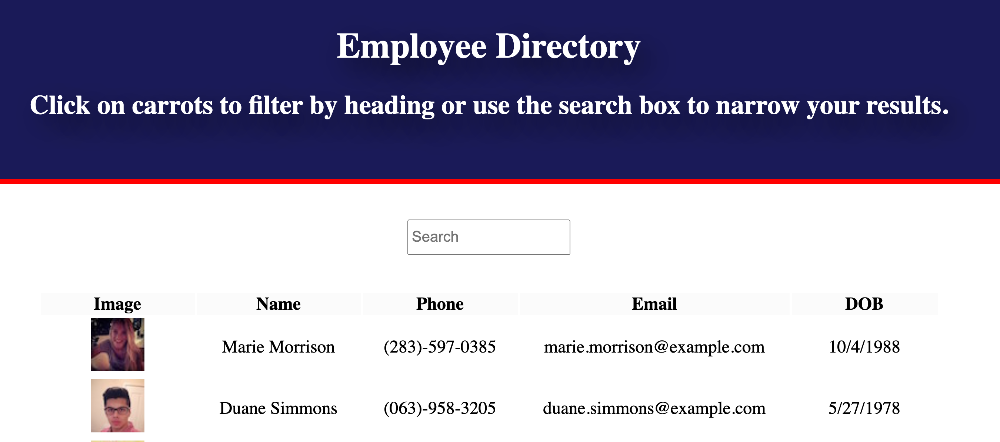
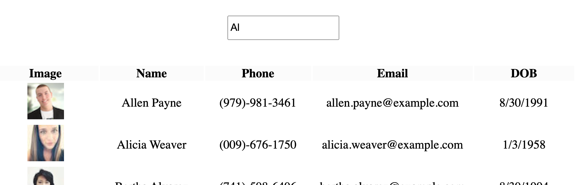
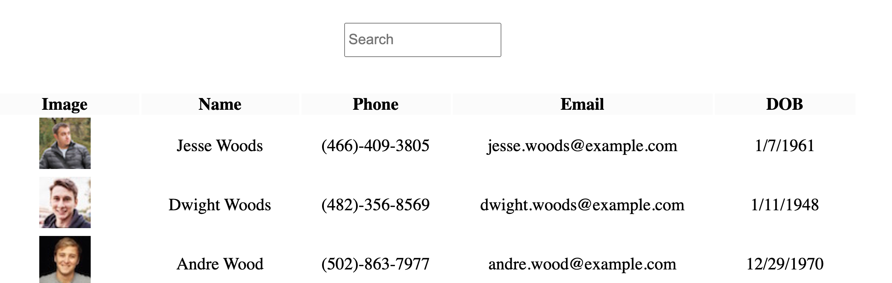

# **HW19-employee-directory**


## **Table of Contents**

* [Description](#Description)
* [Installation](#Installation)
* [Screenshots](#Screenshots)
* [Contributing](#Contributing)
* [Tests](#Tests)
* [License](#License)
* [Questions](#Questions)

## **Description**


The purpose of this assignment was to create an employee directory that allows a manager to pull up basic stats of their employees, dynamically filter through the list and sort by ascending or descending order.  To do this I used axios to call the Random User API (it's free and easy to use, so support it here (https://randomuser.me/)).  I made the front-end with React, which breaks down your application into components which you can then plug in anywhere.  If you're new to React and want to try it out, note that styling is also different. Certain Bootstrap elements like carousel will not function properly and things like "class" are now "className".


## **Installation**
1. Clone the repo
```sh
https://github.com/AWSiegfried/HW19-employee-directory.git
```

2. Install NPM packages
```sh
npm install
```

## **Screenshot**





## **Contributing**

Please feel free to contribute to this repo! Emails are appreciated (email address below) but even then, hopefully it just helps you out!


## **Tests**

Test your library
```sh
npm test
```

## **License**

This repository is covered under the MIT license. 

## **Questions**
Please contact with any questions or thoughts.
Email: awsiegfried@gmail.com

Check out [my GitHub](https://github.com/AWSiegfried)
